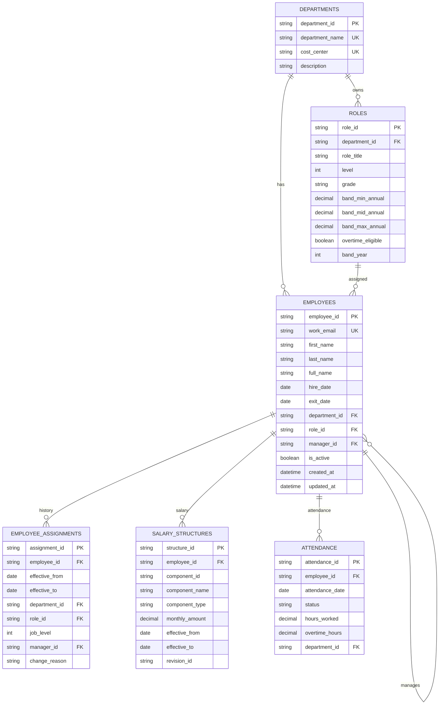

# LedgerForge Phase 1 ER Diagram

```mermaid
erDiagram
    DEPARTMENTS ||--o{ ROLES : owns
    DEPARTMENTS ||--o{ EMPLOYEES : has
    ROLES ||--o{ EMPLOYEES : assigned
    EMPLOYEES ||--o{ EMPLOYEES : manages
    EMPLOYEES ||--o{ EMPLOYEE_ASSIGNMENTS : history
    EMPLOYEES ||--o{ SALARY_STRUCTURES : salary
    EMPLOYEES ||--o{ ATTENDANCE : attendance

    DEPARTMENTS {
        string department_id PK
        string department_name UK
        string cost_center UK
        string description
    }

    ROLES {
        string role_id PK
        string department_id FK
        string role_title
        int level
        string grade
        decimal band_min_annual
        decimal band_mid_annual
        decimal band_max_annual
        boolean overtime_eligible
        int band_year
    }

    EMPLOYEES {
        string employee_id PK
        string work_email UK
        string first_name
        string last_name
        string full_name
        date hire_date
        date exit_date
        string department_id FK
        string role_id FK
        string manager_id FK
        boolean is_active
        datetime created_at
        datetime updated_at
    }

    EMPLOYEE_ASSIGNMENTS {
        string assignment_id PK
        string employee_id FK
        date effective_from
        date effective_to
        string department_id FK
        string role_id FK
        int job_level
        string manager_id FK
        string change_reason
    }

    SALARY_STRUCTURES {
        string structure_id PK
        string employee_id FK
        string component_id
        string component_name
        string component_type
        decimal monthly_amount
        date effective_from
        date effective_to
        string revision_id
    }

    ATTENDANCE {
        string attendance_id PK
        string employee_id FK
        date attendance_date
        string status
        decimal hours_worked
        decimal overtime_hours
        string department_id FK
    }
```
